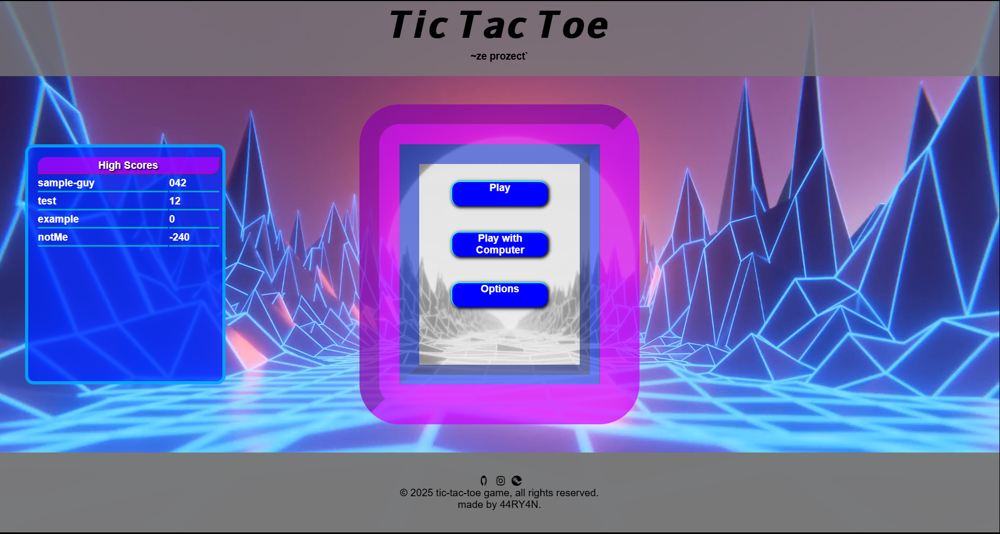

# ❌⭕ Tic-Tac-Toe — The Ultimate Edition

A polished and animated version of the classic Tic-Tac-Toe game featuring multiple game modes, score tracking, theme customization, and a heuristic bot using Minimax algorithm. Built using HTML, CSS, and JavaScript with responsive design and rich transitions.

---

## 🕹️ Live Demo

🔗 [Play Now](https://44RY4N.github.io/tic-tac-toe/)

---

## 🖼️ Preview

 <!-- Replace with actual image path -->

---

## 🛠️ Tech Stack

- **HTML5**: Semantic and accessible structure
- **CSS3**: Responsive layout, transitions, floating UI, and video background
- **JavaScript (ES6+)**: Game logic, DOM manipulation, Minimax AI

---

## 🔍 Features

- 🎮 **Multiple Screens**: Main menu, player selection, game view
- 📹 **Video Background**: Subtle, clean looped background for immersive design
- 🧠 **Minimax AI**: Heuristic bot that plays optimally
- 🎨 **Theme Switcher**: Toggle between different color themes
- 🔄 **Restart & Home Navigation**: Hamburger menu to restart or return anytime
- 📊 **Score Tracker**: Persistent score through game sessions
- 📱 **Responsive**: Fully playable on desktop and mobile

---

## 🚧 How It Works

1. Choose your symbol (X or O) on the player selection screen.
2. Game starts with animations transitioning to the board.
3. Take turns vs. another player or bot.
4. Scores are updated after each round.
5. Use the hamburger menu to restart or go home anytime.

---

## 📦 Project Structure

tic-tac-toe/
├── index.html
├── style.css
├── script.js
├── media/
│ ├── bg-video.mp4
│ └── back.png 
└── README.md

---

## 📈 Lessons Learned

- Implemented **Minimax algorithm** for perfect AI behavior
- Used **CSS transitions** and reusable animations
- Mastered **DOM manipulation** for modular game logic
- Designed **modular structure** for future extensibility

---

## ✨ Future Enhancements

- 🖼️ Add player avatars or profile system
- 🗃️ Store score in localStorage for longer sessions
- 📈 Add difficulty levels for bot
- 🔊 Sound effects for a more interactive experience

---

## 🤝 Acknowledgments

Thanks to The Odin Project and community examples for foundational support and challenge inspiration.

---

## 📬 Contact

Made with 💡 by [44RY4N](https://github.com/44RY4N)  
Star ⭐ the repo if you liked it — and feel free to fork or contribute!

# tic-tac-toe

The following project uses HTML,CSS and Javascript to implemenet tic-tac-toe

features

-interactive transition animation where the header and footer collapse and then expand to reveal the next page
-dedicated menu with video embedded background
-interactive and modern gaming menu 

-Option to play (HUMAN VS HUMAN) as default
-additional option to play against the computer, where the computer uses a heuristic minimax algorithm to find its best moves

-a dedicated player selection menu where user can enter names and select their markers
-a hamburger menu button, this can be translated for mobile responsiveness
-hamburger menu button reveals options to restart game and exit to main-menu, mid-game

-markers use SVG to maintain quality on larger screens
-timeouts can be adjusted to response to page loading with actual world scenarios